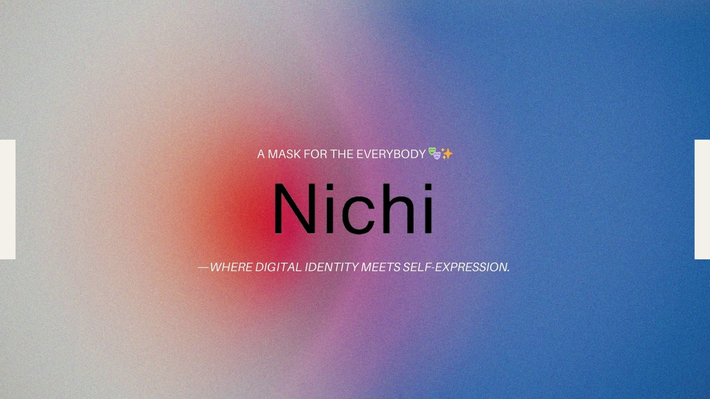
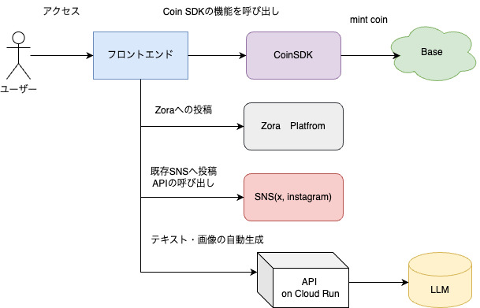

# Nichi



## Live Demo

[Vercel - ]()

## Pitch Slide

[Canva - Pitch Slide](https://www.canva.com/design/DAGkI2goC6c/8OqYgBHUSSNaWSdrU_9_8Q/view?utm_content=DAGkI2goC6c&utm_campaign=designshare&utm_medium=link2&utm_source=uniquelinks&utlId=hf1a0395bec)

## Product Page

[Akindo - Zorahack](https://app.akindo.io/communities/pe6EzVQPafJgLnDE)

## Overview

### "Turn everyday moments into digital art."

This project reimagines the social experience on the blockchain by transforming casual, fleeting moments into unique, AI-powered NFTs.

Inspired by Japanese youth culture, memes, and subcultural aesthetics, our app allows anyone to effortlessly mint and share personalized digital expressions.

### Why we built this

While chatting as a team, we realized something many of us had felt:
We want to share parts of ourselves online, but not necessarily our faces.

Yet when you cover your face in a photo, it often ruins the vibe or aesthetic.

So we asked ourselves—what if hiding your face could become part of the art?

That’s when the idea of “Mask NFTs” was born:
custom, AI-generated masks you can overlay on your photos to keep your privacy and your style.

### Key Features

- Mint tokens with CoinSDK
- Generate metadata and stories using AI
- Create token visuals from uploaded images
- Auto-share on SNS (Instagram, X, Lens, etc.)
- Capture the mood of daily life as art

Through a simple 3-step flow—Upload → Customize → Share—users can turn a photo, a feeling, or even a meme into a tokenized story, ready to be shared with the world.

Let’s blur the line between life and art.

## Archtechture



## Tech Stack

### Frontend

- **TypeScript**
- **Tailwind CSS**
- **shadcn/ui**
- **Next.js**
- **Privy**
- **Vercel**

### Backend

- **Cloud Run**

### Blockchain

- **BaseSepolia**
- **CoinSDK**

### AI

- **Stable Diffusion**
- **OpenAI**
- **Claude**

## How to work

### SetUp

#### create .env

```txt
OPENAI_API_KEY=
```

#### install

```bash
pnpm install
```
### Frontend

#### build

```bash
pnpm run build
```

#### start on localhost

```bash
pnpm run dev
```

## Update Point

### Wave3

In Wave 3, we outlined the product’s overview, architecture, and identified the necessary features for implementation.

In this Wave, we also created a user flow and prioritized clearly defining the project goals.

As a foundation for the project, we created a sample project that directly integrates Next.js with Mastra.

In Wave 4 and Wave 5, we are planning the following updates:

Wave 4

Addition of necessary screens and integration of wallet functionality

Wave 5

Implementation of an AI Agent tool to invoke CoinSDK functions

### Wave4

### Wave5

## Reference

- [Zora ProtocolSDK Document](https://docs.zora.co/protocol-sdk/introduction)
- [1155-contracts](https://github.com/ourzora/zora-protocol/tree/main/packages/1155-contracts)
- [Testnet UI Zora](https://testnet.zora.co/)
- [npm @zoralabs/coins-sdk](https://www.npmjs.com/package/@zoralabs/coins-sdk)
- [GitHub - Zora](https://github.com/ourzora/zora-protocol)
- [Zora Explorer](https://sepolia.explorer.zora.energy/)
- [メタデータフォーマット](https://docs.zora.co/contracts/Metadata)
- [Zora で発行したトークン](https://zora.co/coin/base:0x54ce08574374e7e879074d3c9e95ff9cef01547b)
- [Zenn - NFT 発行プロトコル「Zora」の技術的な概要](https://zenn.dev/senspace/articles/045febcf7a8604)
- [GitHub - ZoraSample Repo](https://github.com/mashharuki/zora-sample)
