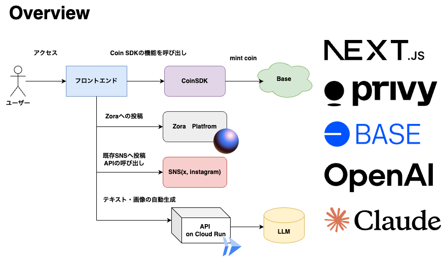

# Nichi

## Live Demo

[Vercel - ]()

## Pitch Slide

[Canva - ]()

## Product Page

[Akindo - Zorahack](https://app.akindo.io/communities/pe6EzVQPafJgLnDE)

## Overview

## Archtechture



## functions

- **A feature to mint tokens using CoinSDK**
- **A feature to generate metadata with AI**
- **A feature to create token images**
- **A feature to automatically post to social media**
- **A feature to automatically generate stories**

## Tech Stack

### Frontend

- **TypeScript**
- **Tailwind CSS**
- **shadcn/ui**
- **Next.js**
- **Privy**
- **Vercel**

### Backend

- **Cloud Run**

### Blockchain

- **BaseSepolia**
- **CoinSDK**

### AI

- **Stable Diffusion**
- **OpenAI**
- **Claude**

## How to work

### SetUp

install

```bash
pnpm install
```

### Agent API

start on localhost

```bash
pnpm api run dev
```

### CDK for Terraform

### Frontend

build

```bash
pnpm frontend run build
```

start on localhost

```bash
pnpm frontend run dev
```

## Reference

- [Zora ProtocolSDK Document](https://docs.zora.co/protocol-sdk/introduction)
- [1155-contracts](https://github.com/ourzora/zora-protocol/tree/main/packages/1155-contracts)
- [Testnet UI Zora](https://testnet.zora.co/)
- [npm @zoralabs/coins-sdk](https://www.npmjs.com/package/@zoralabs/coins-sdk)
- [GitHub - Zora](https://github.com/ourzora/zora-protocol)
- [Zora Explorer](https://sepolia.explorer.zora.energy/)
- [メタデータフォーマット](https://docs.zora.co/contracts/Metadata)
- [Zora で発行したトークン](https://zora.co/coin/base:0x54ce08574374e7e879074d3c9e95ff9cef01547b)
- [Zenn - NFT 発行プロトコル「Zora」の技術的な概要](https://zenn.dev/senspace/articles/045febcf7a8604)
- [GitHub - ZoraSample Repo](https://github.com/mashharuki/zora-sample)
